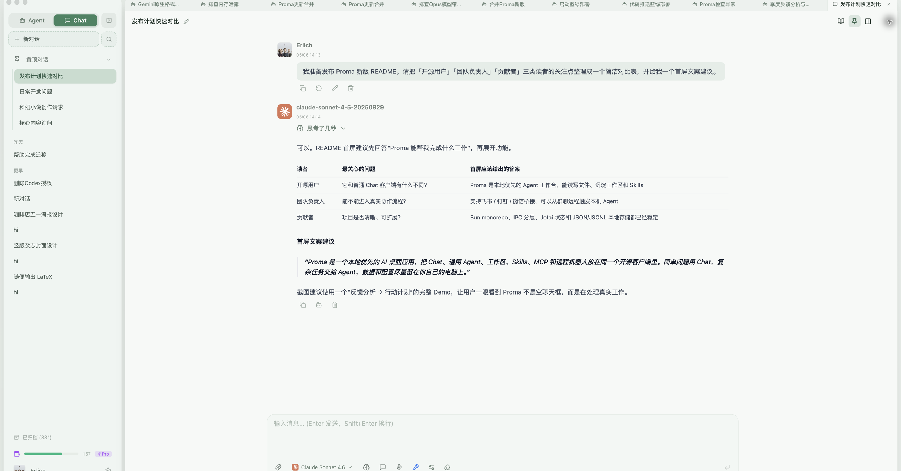
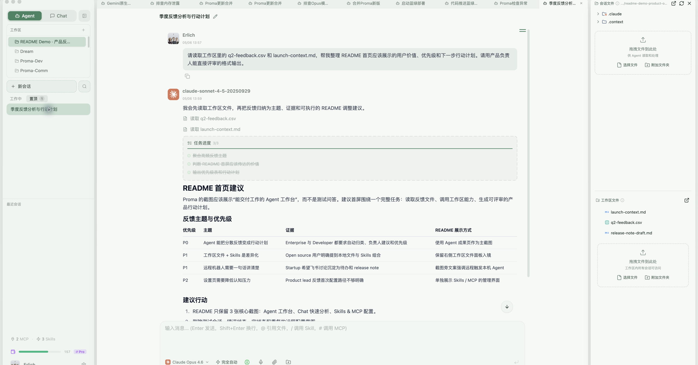
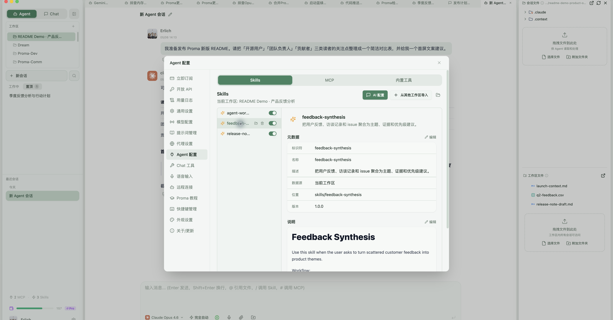
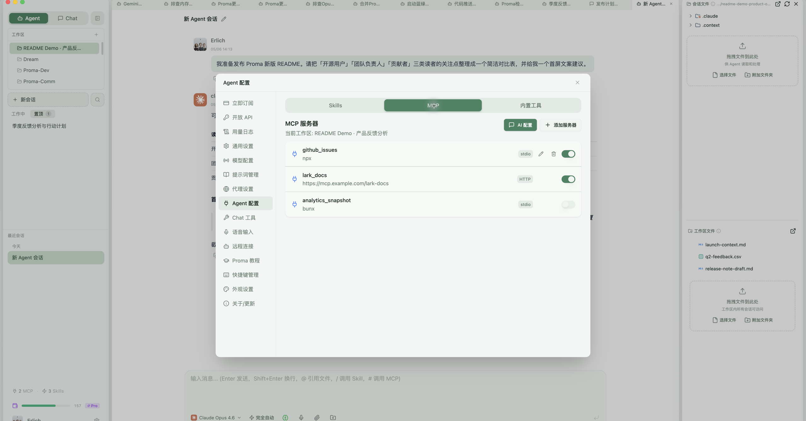
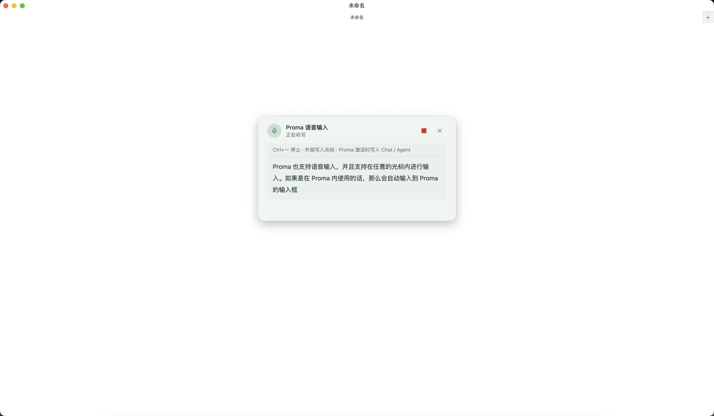

# Xcode


Xcode 是一个本地优先的开源 AI 桌面应用，**基于 [Proma 开源版本](https://github.com/proma-ai/Proma) 进行二次开发**，把多模型 Chat、通用 Agent、工作区、Skills、MCP、远程机器人和记忆能力放在同一个客户端里。

它不是只面向闲聊的聊天框，而是一个可以长期沉淀个人工作流的 Agent 工作台：简单问题用 Chat，复杂任务交给 Agent，数据和配置尽量留在本地。

[English README](./README.en.md) | [新手教程（沿用 Proma 文档）](./tutorial/tutorial.md) | [下载 Xcode](https://github.com/maochiy/Xcode/releases) | [项目仓库](https://github.com/maochiy/Xcode)

## 项目来源与关系

- **上游项目**：[Proma](https://github.com/proma-ai/Proma)，由 Erlich Liu 及社区贡献者开发。感谢原项目提供的桌面应用架构与基础能力。
- **本项目**：Xcode 是独立维护的衍生项目，在 Proma 开源代码基础上继续开发；不是从零实现，也不是 Proma 官方发行版或商业版。
- **当前版本方向**：采用石墨黑圆润交叉图标，内置 Pi Runtime，并在 `maochiy/Xcode` 通过 GitHub Actions 构建和发布；首个版本为 `v0.0.1`。
- **兼容性**：保留 `@proma/*` 内部包名、`proma` CLI、`~/.proma/` 数据路径及必要的旧身份标识，避免仅因更名破坏现有配置；这些不是遗漏的品牌替换。
- **许可证与署名**：保留上游版权、许可证和贡献历史，继续采用仓库中的 [AGPL-3.0 许可证](./LICENSE)。

> 本项目与 Apple 的 Xcode 开发工具无关，也不隶属于 Apple。macOS 应用包名为 `Xcode-Desktop.app`，应用显示名称为 **Xcode**。

## 现在能做什么

- **Chat 模式**：多模型对话、附件解析、图片输入、Markdown / Mermaid / KaTeX / 代码高亮、并排对话、系统提示词、上下文管理。
- **Agent 模式**：内置 Pi Runtime，支持工作区隔离、权限模式、文件操作、长任务流式输出、计划确认和用户追问；当前版本不再提供 Claude Agent SDK 内核切换。
- **协作与任务**：复杂任务可拆分为可追踪的协作子 Agent / Task，并在消息流中展示调用过程和结果。
- **Skills & MCP**：每个工作区可以独立配置 Skills、MCP Server 和工作区文件，适合沉淀可复用能力。
- **远程机器人**：支持飞书 / Lark 机器人桥接，并已提供钉钉、微信桥接入口，用手机或群聊触发本机 Agent 工作流。
- **记忆与工具**：Chat 和 Agent 可共享记忆能力，并支持联网搜索、内置 Chat 工具、Agent 推荐等辅助能力。
- **本地优先**：会话、工作区、附件、配置、Skills 等默认存储在 `~/.proma/`，使用 JSON / JSONL 文件组织，不依赖本地数据库。
- **桌面体验**：自动更新、代理设置、文件预览、全局快捷键、快速任务窗口、语音输入、亮色 / 暗色 / 跟随系统主题。

## 快速开始

### 下载安装

从 [Xcode GitHub Releases](https://github.com/maochiy/Xcode/releases) 下载安装包。首版 [v0.0.1](https://github.com/maochiy/Xcode/releases/tag/v0.0.1) 提供：

- macOS Apple Silicon（arm64）：DMG / ZIP。
- macOS Intel（x64）：DMG / ZIP。
- Windows（x64）：EXE 安装程序。

**安装前请注意：**

- `v0.0.1` 安装包未配置开发者签名或 Apple 公证，请确认下载来源并留意系统安全提示。
- macOS 使用 `Xcode-Desktop.app`，避免覆盖 Apple 的 `Xcode.app`。
- 版本号在新仓库从 `0.0.1` 重新起步，旧 Proma 的较高版本不会自动降级到此版本，需要手动安装。
- Xcode 保留 Proma 数据路径，默认不是与 Proma 完全隔离的数据副本；建议安装前备份 `~/.proma/`，不要同时操作同一份数据。

### 首次配置

1. 打开 Xcode，先完成环境检查。Agent 模式依赖本机基础环境，尤其是 Git、Node.js / Bun 以及可用的 Shell。
2. 进入 **设置 > 渠道**，添加至少一个 AI 供应商渠道，填写 Base URL、API Key 和模型列表。
3. Chat 模式可以使用 OpenAI、Anthropic、Google 或 OpenAI 兼容协议的渠道。
4. Agent 使用内置 Pi Runtime，选择已启用且协议受支持的渠道与模型；不需要安装或切换 Claude Agent SDK。
5. 进入 **设置 > Agent**，选择默认 Agent 渠道、模型和工作区。
6. 如需记忆、联网搜索、飞书 / 钉钉 / 微信桥接，在设置页对应 Tab 中继续配置。

## 模式选择

### Chat 适合

- 日常问答、解释、翻译、润色、轻量代码讨论。
- 读取附件内容后做总结、改写、比较。
- 使用联网搜索或记忆工具增强一次性对话。
- 同时对比多个模型输出，或用不同系统提示词做探索。

### Agent 适合

- 修改、创建、整理本地文件。
- 调研、编写报告、处理多步骤任务。
- 使用 MCP、Skills、Shell、Git、项目文件等外部上下文。
- 需要权限确认、计划模式、后台任务或远程机器人持续跟进的工作。

简单说：**只需要回答时用 Chat，需要行动和交付结果时用 Agent。**

## 截图

> 以下截图沿用 Proma 阶段的历史素材，仅用于说明功能，不代表 Xcode 当前名称、图标或界面的最终样式。

### Chat 快速分析

用 Chat 处理轻量但真实的分析任务：整理读者关注点、生成对比表，并把首屏文案快速定稿。



### Agent 工作台

Agent 在工作区里读取文件、推进任务、输出表格化结论，并把可复用文件保留在右侧工作区面板中。



### Skills

每个工作区都可以沉淀专属 Skills。截图中的 `feedback-synthesis` 用于把用户反馈、访谈记录和 issue 聚合成主题、证据与优先级建议。



### Skills & MCP

同一个工作区可以管理 stdio / HTTP MCP Server，按需启用或关闭，让 Agent 在不同项目里获得不同的外部上下文。



### 流式语音输入（支持全局输入）

Xcode 支持豆包的流式语音输入功能，并且支持在应用内和其他桌面应用中使用：

- 应用内部：按 Ctrl + Backtick（反引号键）触发识别，再次按下结束并输入到 Xcode 内对应的输入框。
- 应用外部：按同一快捷键触发识别，再次按下结束并输入到当前光标所在处；如无光标则写入剪贴板。



## Agent 运行时与模型渠道

Xcode 的 Agent 模式统一使用 **Pi Runtime**，基于 `@earendil-works/pi-coding-agent`、`pi-agent-core` 和 `pi-ai`，将已启用渠道动态注册为 Pi provider；支持 OpenAI Chat Completions / Responses、Google Generative AI、Anthropic Messages 及其兼容端点。支持 Anthropic 模型不等于内置 Claude Agent SDK。

模型中心中选择的**供应商协议是 Runtime 的唯一协议来源**。普通 `openai`、`custom`、智谱 AI、豆包、通义千问等 OpenAI 兼容渠道固定使用 Chat Completions；只有明确选择 `openai-responses` 或 ChatGPT 订阅时才使用 Responses。Pi 不会根据模型名、Base URL 或 API Key 猜测协议。

| 渠道类型 | Chat | Pi Agent |
| --- | --- | --- |
| Anthropic / Anthropic 兼容 | 支持 | 支持 |
| DeepSeek、Kimi API / Coding Plan、智谱 Coding Plan、MiniMax、小米 MiMo 等 Anthropic 协议渠道 | 支持 | 支持 |
| OpenAI、OpenAI Responses、Google、智谱 AI、豆包、通义千问 | 支持 | 支持 |
| OpenAI 兼容自定义端点 | 支持 | 支持 |
| ChatGPT 订阅（Codex OAuth） | — | 支持 |

> 切换协议、渠道凭证或模型后，Pi 会从原生 Session 文件重建该 Session，不会删除或改写 Xcode 中已保存的历史消息。Pi 会桥接工作区 Skills、用户 MCP Server，以及内置的 Automation / Collaboration 工具；不同模型供应商对工具调用、推理和上下文长度的支持仍可能不同。

> Pi Worker 按 Runtime Build 共享：同一 Build 最多启动一个 Worker，在其中承载多个隔离 Session。Session 空闲 15 分钟后回收，每个 Build 最多保留 8 个空闲 Session；Worker 无 Session 60 秒后退出。工具请求始终携带 `sessionId`，避免共享 Worker 后串会话。

> Agent 思考内容采用 Cursor 风格固定高度面板：模型返回的全部 thinking 原文按顺序持续追加，在过程正文阶段始终位于正文下方并默认自动滚动到最新内容；用户上滚后暂停跟随，可点击“回到最新”恢复。最终正文首个增量出现后隐藏思考区，让最终回答独立展示。思考与正文的累计 SSE 快照都会经过按字素逐帧追加的平滑队列，不再整块跳出。

> 第三方订阅渠道的可用性及客户端授权以供应商规则为准。Xcode 不声称继承 Proma 的供应商白名单或商业授权。

## 本地数据

Xcode 采用本地文件存储，方便备份、迁移和排查问题。为保持既有数据兼容，目录仍为 `~/.proma/`。

```text
~/.proma/
├── channels.json
├── conversations.json
├── conversations/
│   └── {conversation-id}.jsonl
├── agent-sessions.json
├── agent-sessions/
│   └── {session-id}.jsonl
├── agent-workspaces/
│   └── {workspace-slug}/
│       ├── workspace-files/
│       ├── mcp.json
│       └── skills/
├── attachments/
├── user-profile.json
├── settings.json
└── sdk-config/
```

API Key 会通过 Electron `safeStorage` 加密后写入 `channels.json`。Xcode 不使用本地数据库，核心数据结构以 JSON 配置和 JSONL 追加日志为主。

## 开发

Xcode 沿用 Proma 的 Bun workspace monorepo 结构和 `@proma/*` 内部包作用域。

```text
Xcode/
├── packages/
│   ├── shared/     # 共享类型、IPC 常量、配置、工具函数
│   ├── core/       # Provider Adapter、SSE、代码高亮
│   ├── session-core/ # 会话读取、分组、搜索与渲染核心
│   └── ui/         # 共享 React UI 组件
└── apps/
    ├── cli/        # 兼容的 proma 命令行工具
    └── electron/   # Electron 桌面应用
```

当前主要包版本：

| 包 | 版本 | 职责 |
| --- | --- | --- |
| `@proma/electron` | `0.0.1` | Electron 桌面应用 |
| `@proma/cli` | `0.1.0` | 兼容的 proma CLI |
| `@proma/shared` | `0.1.72` | 共享类型、IPC 常量、配置和工具 |
| `@proma/core` | `0.2.17` | Provider Adapter、SSE、Shiki 高亮 |
| `@proma/session-core` | `0.1.6` | 会话核心能力 |
| `@proma/ui` | `0.1.11` | 共享 React UI 组件 |

常用命令：

```bash
# 获取源码
git clone https://github.com/maochiy/Xcode.git
cd Xcode

# 安装依赖
bun install

# 开发模式：自动启动 Vite + Electron + 热重载
bun run dev

# 构建 Electron 应用
bun run electron:build

# 构建并运行
bun run electron:start

# 类型检查
bun run typecheck

# 测试
bun test
```

Electron 子应用内也提供更细的脚本：

```bash
cd apps/electron

bun run dev:vite
bun run dev:electron
bun run build:main
bun run build:preload
bun run build:renderer
bun run dist:fast
```

## 技术栈

| 层级 | 技术 |
| --- | --- |
| 运行时 | Bun |
| 桌面框架 | Electron 39 |
| 前端 | React 18 + TypeScript |
| 状态管理 | Jotai |
| 样式 | Tailwind CSS + Radix UI |
| 富文本输入 | TipTap |
| Markdown / 图表 / 公式 | React Markdown + Beautiful Mermaid + KaTeX |
| 代码高亮 | Shiki |
| 构建 | Vite + esbuild |
| 分发 | electron-builder |
| Agent Runtime | Pi：`@earendil-works/pi-* @0.80.9` |

## 架构概览

Xcode 的核心通信路径是：

```text
shared 类型和 IPC 常量
  -> main/ipc.ts 注册处理器
  -> preload/index.ts 暴露 window.electronAPI
  -> renderer Jotai atoms 和 React 组件调用
```

主进程服务集中在 `apps/electron/src/main/lib/`：

- `agent-orchestrator.ts`：Agent 编排、运行时路由、环境变量、SDK 调用、事件流、错误处理。
- `runtime/pi-runtime-adapter.ts` / `runtime/frakio-pi-runtime-adapter.ts`：Pi 运行时适配；配合 `resources/pi-runtime/` 中的 Bridge / Worker 管理会话与事件。
- `agent-session-manager.ts`：Agent 会话索引和 JSONL 消息持久化。
- `agent-workspace-manager.ts`：工作区、MCP、Skills 和工作区文件管理。
- `chat-service.ts`：Chat 流式调用、Provider Adapter、工具活动。
- `conversation-manager.ts`：Chat 会话索引和消息存储。
- `channel-manager.ts`：渠道 CRUD、API Key 加密、连接测试、模型获取。
- `feishu-bridge.ts` / `dingtalk-bridge.ts` / `wechat-bridge.ts`：远程机器人桥接。
- `chat-tool-*`、`document-parser.ts`、`workspace-watcher.ts`：工具、文档解析和文件监听。

渲染进程以 Jotai 管理状态，关键 atoms 位于 `apps/electron/src/renderer/atoms/`。Agent IPC 监听器在应用顶层全局挂载，避免切换页面时丢失流式事件、权限请求或后台任务状态。

## 打包注意事项

当前版本仅打包 Pi Runtime。`bun run electron:build` 构建主进程、Preload、渲染进程、打包 Hooks 与自包含 `proma` CLI。`electron-builder.yml` 将 Pi Bridge / Worker、兼容补丁、CLI 和默认 Skills 作为资源打包，并将运行时依赖保留在 ASAR 外，供独立 Worker 解析。

修改打包配置时，请确认：

- `build:main` / `watch:main` 保留 `electron`、`node-pty` 的 external 配置。
- `electron-builder.yml` 包含 Pi 运行时依赖、原生模块及所需 `asarUnpack` / `extraResources` 规则。
- `scripts/electron-builder-after-pack.ts` 和 `scripts/electron-builder-after-sign.ts` 的 CLI 校验正常执行。
- 在目标平台打包后，验证 Pi 可以启动、调用工具和恢复会话；仅构建成功不代表这些功能已验证。

### GitHub Actions 发布

[Release 工作流](./.github/workflows/release.yml) 支持推送 `v*` tag，或手动指定 `release_tag`：

1. 校验仓库、应用名称和 tag 对应版本，运行类型检查与发布流程测试。
2. 分别构建 macOS arm64、macOS x64 和 Windows x64。
3. 汇总并校验安装包、blockmap 与自动更新清单，再正式发布 GitHub Release。

后续版本的下载与自动更新均指向 `maochiy/Xcode`，不是 Proma 上游的发布渠道。

更完整的工程约定见 [AGENTS.md](./AGENTS.md)。

## 贡献

欢迎修 Bug、补文档、加测试、完善体验，也欢迎围绕真实场景提交新的 Skills、MCP 配置或 Agent 工作流。

提交 PR 前建议先确认：

- 使用 Bun 运行脚本，不混用 npm / pnpm lockfile。
- 状态管理使用 Jotai。
- 尽量保持本地优先，优先使用配置文件和 JSON / JSONL。
- TypeScript 不使用 `any`，对象结构优先使用 `interface`。
- 新增 IPC 时同步修改 shared 类型、main handler、preload bridge 和 renderer 调用。
- 影响包行为时递增对应 package 的 patch 版本。
- 能用测试覆盖的行为尽量补上测试，尤其是共享逻辑、IPC 契约和持久化格式。

## 维护与原作者

- Xcode 维护仓库：[maochiy/Xcode](https://github.com/maochiy/Xcode)。
- Proma 原作者：Erlich Liu（[个人网站](https://erlich.fun)）及 [Proma 社区贡献者](https://github.com/proma-ai/Proma/graphs/contributors)。

## 致谢

- [Proma](https://github.com/proma-ai/Proma)：本项目二次开发的代码基础，感谢原作者及所有贡献者。
- [Shiki](https://shiki.style/)：代码高亮。
- [Beautiful Mermaid](https://github.com/lukilabs/beautiful-mermaid) 与 [Mermaid](https://mermaid.js.org/)：Mermaid 图表渲染与官方兜底渲染。
- [Cherry Studio](https://github.com/CherryHQ/cherry-studio)：多供应商桌面 AI 产品启发。
- [Lobe Icons](https://github.com/lobehub/lobe-icons)：AI / LLM 品牌图标。
- [Craft Agents OSS](https://github.com/lukilabs/craft-agents-oss)：Agent SDK 集成模式参考。

## 许可证

Xcode 基于 Proma 开源版本继续开发，沿用 [GNU Affero General Public License v3.0（AGPL-3.0）](./LICENSE)。原项目版权与许可证声明予以保留，完整条款以根目录 `LICENSE` 文件为准。

本项目不代表 Proma 原作者提供商业授权，也不因更名而改变上游代码的许可证。
