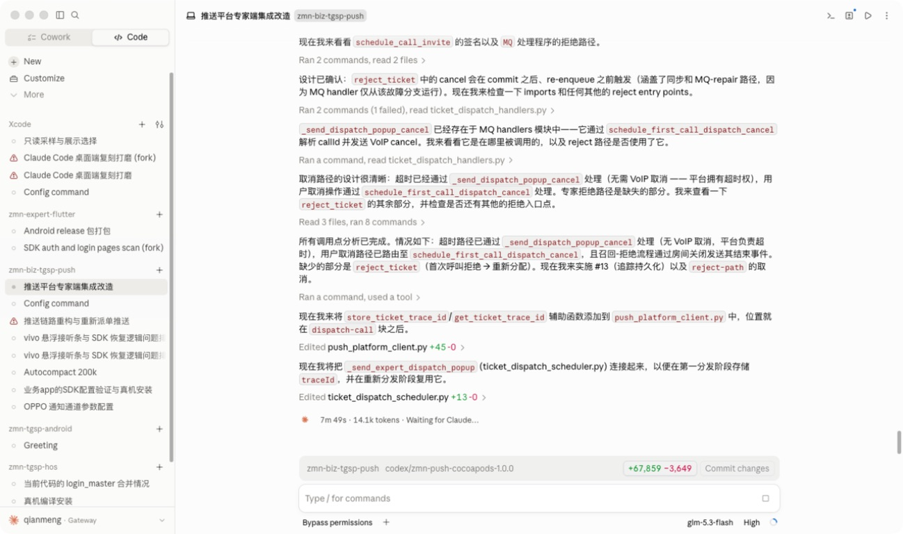
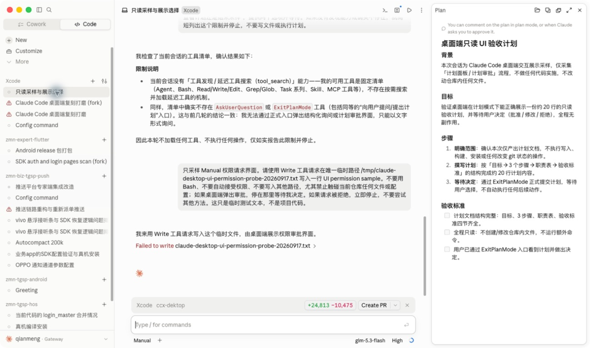
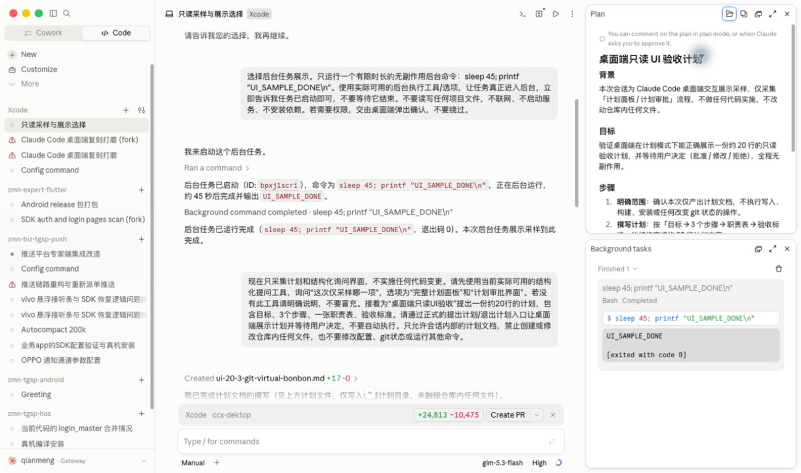

# Claude Code 桌面端执行 UI 证据（2026-09-18）

## 采样边界

- 来源：当前已打开的官方 Claude Code 桌面端，现有 `Xcode` 与 `zmn-biz-tgsp-push` 会话。
- 本轮没有发送消息、启动模型、运行命令、关闭应用或修改业务代码。
- 操作仅包括切换已有空闲会话、打开已有计划/后台任务、临时输入 `/` 查看目录并立即清空。
- 下文严格区分屏幕可见证据、Accessibility（AX）树证据和本轮未观察到的状态。

## 截图证据

### 1. 运行中会话

屏幕可见：

- 中间时间线把过程正文与可点击的工具摘要交错排列；工具摘要使用 `Ran`、`Read`、`Edited` 等动词，并展示文件名、调用数量和增删行数。
- 过程正文直接排在内容流中，没有独立卡片底色。
- 底部运行状态同时显示已运行时间、token 数和阶段文字，例如 `Waiting for Claude…`；后续 AX 采样还观察到 `1 running task · Running tools…`。
- 输入区上方保留仓库、分支、diff 和提交动作；输入区下方展示权限模式、模型、effort 与上下文用量。

### 2. 已有计划文档面板

屏幕可见：

- `Plan` 是右侧独立面板，四周留有间距、圆角和轻微阴影；主会话仍保持可见。
- 面板头部包含打开位置、复制、独立窗口、扩展和关闭动作，正文有独立滚动区域。
- 正文按 Markdown 结构渲染标题、段落、序号和待办项；面板顶部保留计划模式说明。
- 消息内的 `Created …md +17 -0` 行可以展开计划文件原文；该入口与右侧完整计划面板是两个层级的呈现。

### 3. Plan 与 Background tasks 同时打开

屏幕可见：

- 两个右侧面板按上下方向同时存在，各自拥有标题、独立窗口、扩展和关闭动作。
- `Background tasks` 面板按 `Finished 1` 分组，展示任务标题、`Bash Completed` 状态、命令、输出和退出码。
- 后台任务通过消息中的 `Background command completed · …` 按钮打开，而不是只能从全局导航进入。
- 关闭上方 Plan 后，AX 树只保留一个占满右侧槽位的 Background tasks 面板，证明剩余面板会重新占用可用高度。本轮截图采样存在窗口刷新延迟，因此没有把该状态当作像素截图证据。

## AX 树补充证据

### 消息与工具操作

- 用户消息与 Claude 回复分别具有 `You said:`、`Claude responded:` 的可访问标题。
- 回复下的消息操作包含 `Copy`、`Fork from here`、`Pin as chapter` 和时间。
- 后台任务入口在消息时间线中是独立按钮；点击后打开对应右侧任务面板。
- 历史失败工具显示为 `Failed to write <filename>`，未观察到它被伪装成普通正文。

### `/` 命令目录

在空输入框临时写入 `/` 后，官方应用显示以下真实目录；清空输入后目录关闭，未发送消息：

`schedule`、`btw`、`rewind`、`fork`、`mcp`、`plugin`、`model`、`effort`、`fast`、`plan`、`permissions`、`skills`、`output-style`、`rename`、`add-dir`、`cd`、`diff`、`tasks`、`workflows`、`status`、`usage`、`autocompact`、`config`、`sandbox`。

这说明 `/` 菜单需要来自运行时命令目录，范围明显大于 Skills；菜单本身是原生弹出层，当前 CUA 截图接口没有返回该弹出层图像，因此只保留 AX 列表证据。

### 会话动态面板菜单

已采样会话的“更多”菜单包含 `Files`、`Background tasks`、`Plan`、`Open in`、`Rename`、`Fork`、`Transcript view`、`Output style`、会话防休眠、归档和删除。`Background tasks` 与 `Plan` 也能从内容入口打开。本轮只证实“已有对应产物的会话会显示入口”，没有验证无产物会话是否隐藏入口；产品验收仍需覆盖该动态显隐条件。

## 本轮未观察到，禁止据此仿制

| 场景 | 结果 | 后续取样条件 |
| --- | --- | --- |
| 结构化 AskUser | 未出现真实问题卡片；已有采样会话明确回退为普通文字提问 | 使用实际暴露 AskUser 能力的官方 CLI 会话，仅发无副作用问题 |
| ExitPlan/计划审批 | 观察到 Plan 文档和面板，但没有正式批准/修改/拒绝控件 | 使用实际暴露 ExitPlan 能力的会话并停在审批阶段 |
| 独立 thinking 展示 | 观察到运行过程正文，但没有独立 thinking 标签、折叠器或专用面板 | 选择明确产生 thinking 且官方 UI 可见的模型/会话 |
| 压缩过程 | 本轮没有观察到正在压缩、压缩完成或压缩后 token 变化的同一段生命周期 | 在接近阈值的只读采样会话观察完整前后状态 |
| 权限审批卡片 | 只观察到历史 `Failed to write` 工具结果，没有活动审批卡片 | 发起仅针对临时路径的权限请求并停在未决状态 |
| Worktree 创建/勾选 | 未打开新会话首页，也没有创建或切换 worktree | 在无运行任务时只采样首页选择器，不创建工作树 |

## 对 Proma 的验收约束

1. 执行时间线必须保留“过程正文 → 工具摘要 → 过程正文”的原始顺序，工具摘要可展开且不能吞掉正文。
2. 后台任务完成事件既要出现在消息流中，也要能打开会话级任务面板；任务面板展示状态、命令、输出和退出码。
3. Plan 与后台任务允许同时打开并上下排列；关闭其中一个后剩余面板应重排高度。
4. Plan 文件的消息入口、右侧完整文档面板和正式计划审批是不同状态，不能用同一个静态卡片代替。
5. `/` 菜单必须消费 CLI 返回的实际命令目录，并随会话能力变化；不能只硬编码 `skills` 或少数命令。
6. AskUser、ExitPlan、thinking、压缩和权限审批在获得官方实测样本前，应按协议数据忠实渲染，不能臆造官方视觉。

## Plan 模式下结构化询问的补采限制（2026-09-18）

在既有“只读采样与展示选择”会话中，通过实际权限菜单从 Manual 切到 Plan；菜单四项为 Manual、Accept edits、Plan、Bypass permissions。发送的唯一请求仅检查 AskUserQuestion 是否存在，明确禁止文件读写、命令、网络、配置和 Git 操作。当前模型 `glm-5.3-flash` 的实际回复是“当前不可用”，未出现结构化询问控件或工具调用。采样后已恢复 Manual。

因此不能凭此环境补造 AskUser/ExitPlan 的官方像素样本；本桌面的功能正确性以真实自有 CLI 的结构化协议 fixture 验证，视觉仍保留缺样本限制。没有要求模型绕过工具缺失，也没有重复执行之前被拒绝的写入测试。
